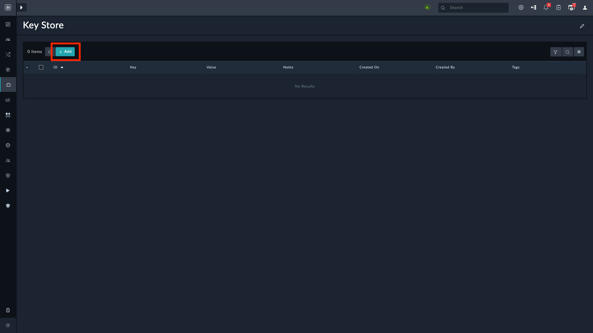
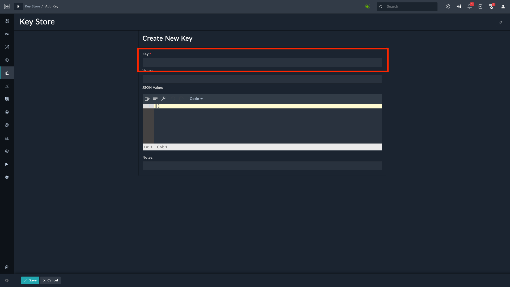
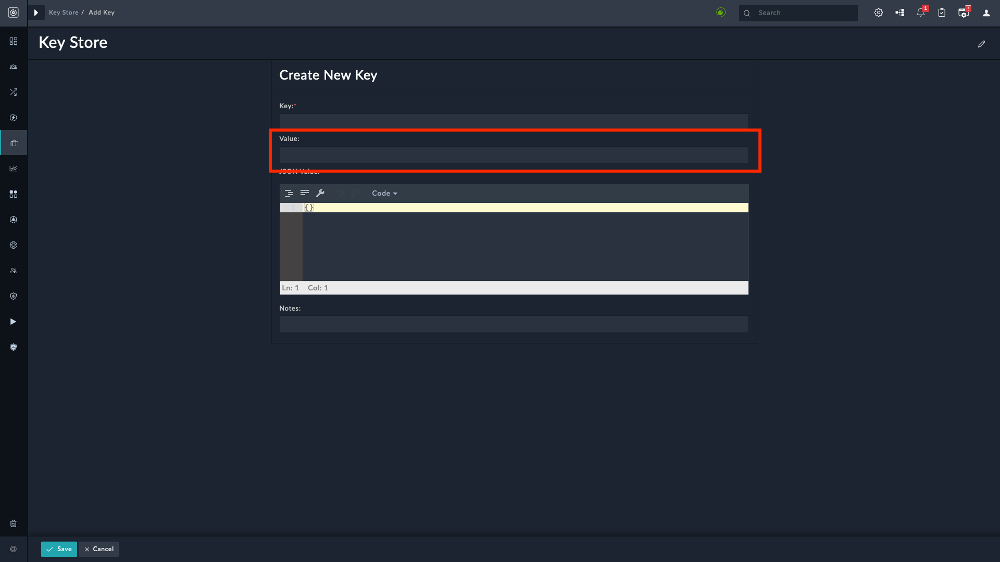
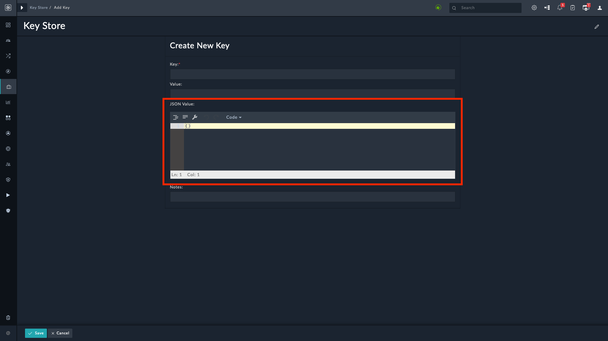
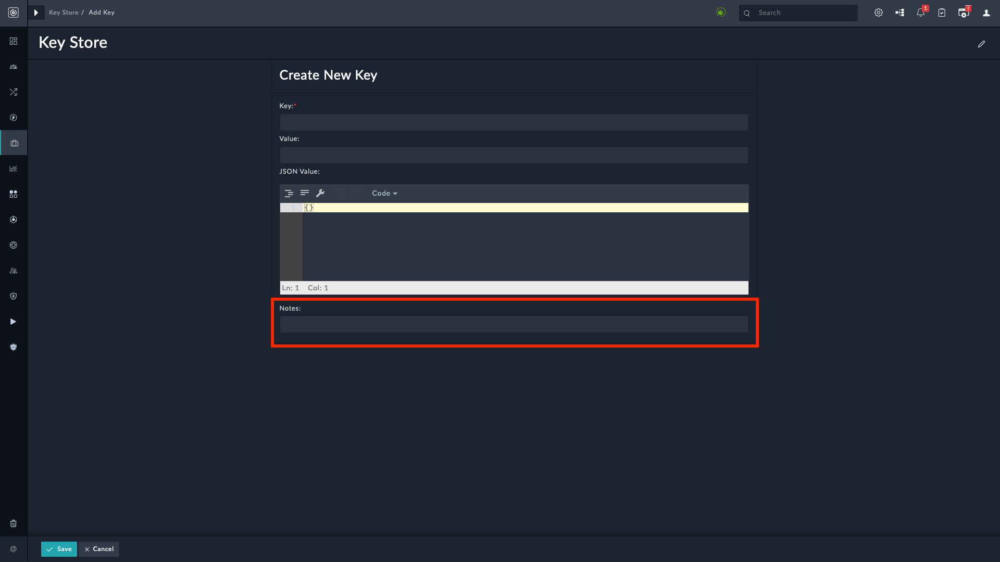
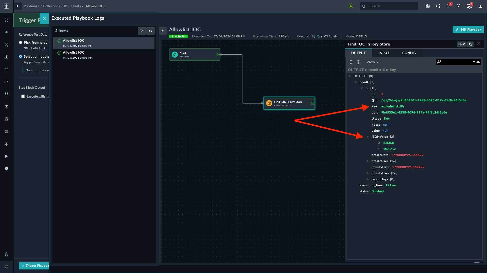
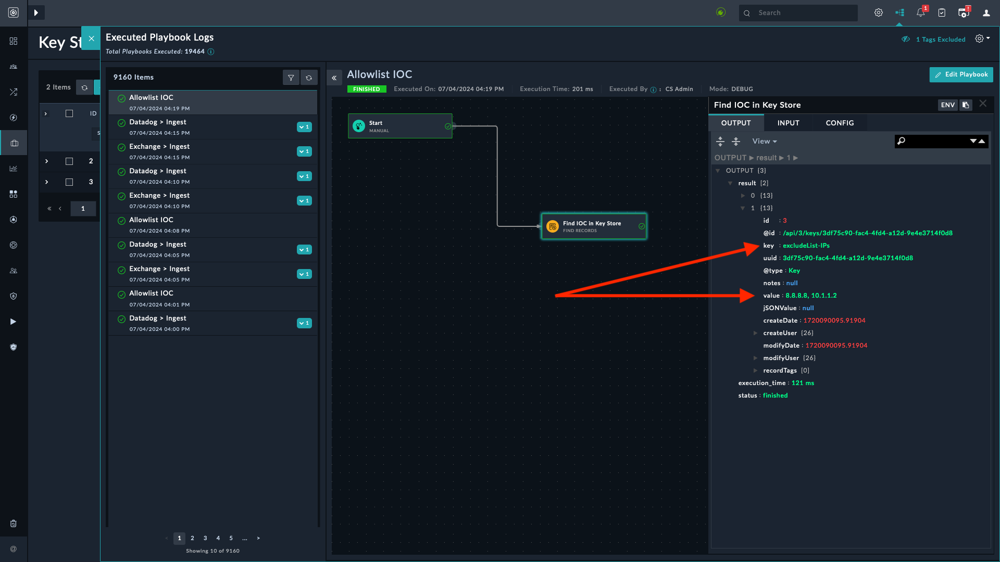

[Home](../README.md) |
 | -------------------------------------------- |

# Usage

The **Platform Utilities** solution pack deploys the *Key Store* module. This module can be accessed from **Resources** in the navigation menu.

## Adding a record in the key store module

1. Navigate to the **Resources** section from the main menu.

2. Select **Key Store**.

3. Click **+ Add** to create a *Key Store* record.

    

4. Specify a key of the key-value pair in the **Key** field.

    

5. Specify a value for the key-value pair in the **Value** field.

    

6. Specify a JSON object or a list in the **JSON Value** field.

    

7. Specify any additional notes or comments in the **Note** field.

    

## Using key store record with `Key` and `JSON Value`

Let us create a key store record using the following JSON as an example:

```JSON
{
  "excludeList_IPs": [
    "8.8.8.8",
    "10.1.1.2"
  ]
}
```

1. Enter `excludeList_IPs` in the **Key** field.

2. Enter `["8.8.8.8","10.1.1.2"]` in the **JSON Value** field.

3. Set the playbook mode to Debug to view the output. Refer to [Playbooks Guide](https://docs.fortinet.com/document/fortisoar/7.5.0/playbooks-guide/274356/debugging-and-optimizing-playbooks#Debugging_Playbooks) in platform documentation for more information.

A sample playbook finds the key store record and displays its value. Following image displays the output:



## Using key store record with `Key` and `Value`

Create a key store record as per the following information.

1. Enter `excludeList_IPs` in the **Key** field.

2. Enter `8.8.8.8, 10.1.1.2` in the **Value** field.

3. Set the playbook mode to Debug to view the output. Refer to [Playbooks Guide](https://docs.fortinet.com/document/fortisoar/7.5.0/playbooks-guide/274356/debugging-and-optimizing-playbooks#Debugging_Playbooks) in platform documentation for more information.

A sample playbook finds the key store record and displays its value. Following image displays the output:




# Next Steps

| [Installation](./setup.md#installation) | [Configuration](./setup.md#configuration) | [Contents](./contents.md) |
|-----------------------------------------|-------------------------------------------|---------------------------|